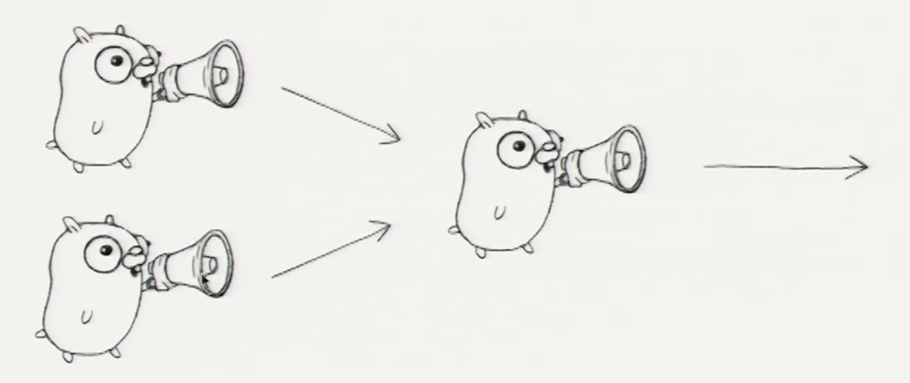

# Go concurrency patterns

This is not a great repo. It's about following the [Goggle I/O - Go Concurrency patterns](https://www.youtube.com/watch?v=f6kdp27TYZs&t=1223s) presentation, learning about Go concurrency, patterns, etc.

## 01 - Generator

Function that returns a channel

```go
// this is a generator function
func boring(msg string) <-chan string { // Returns receive-only channel of strings
	c := make(chan string)
	go func() { // we launch the gorutine from inside the function
		for i := 0; ; i++ {
			c <- fmt.Sprintf("%s %d", msg, i)
			time.Sleep(time.Duration(rand.Intn(1e3)) * time.Millisecond)
		}
	}()
	return c // returns the channel to the caller
}
```

## 02 - 	Multiplexing / FanIn

Get two (many) gorutines and send each result via a channel.



Two examples:

  - One with two gorutines
  - One with one gorutine and a select


## Notes/ Articles

  - [Curious Channels](https://dave.cheney.net/tag/golang-3)
